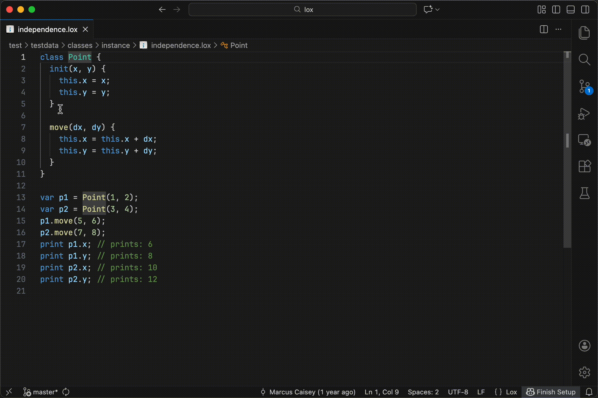
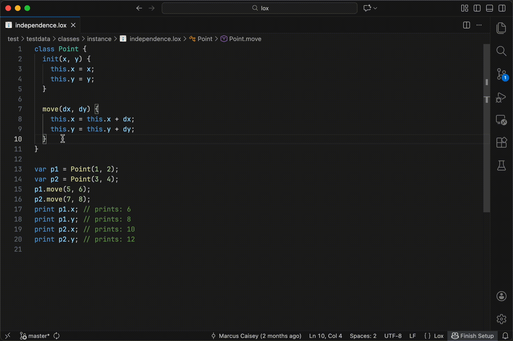
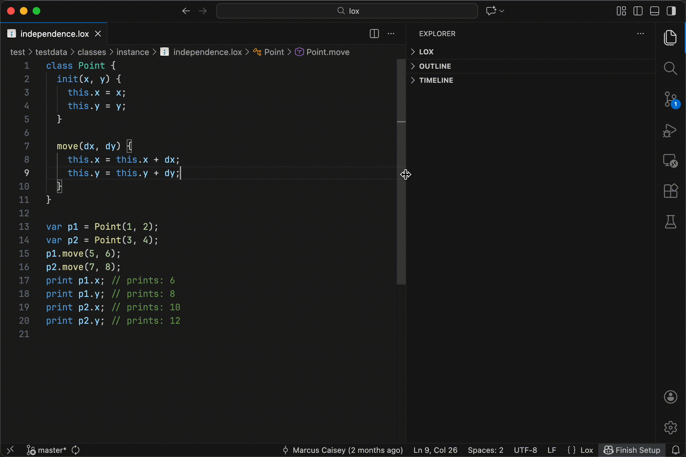
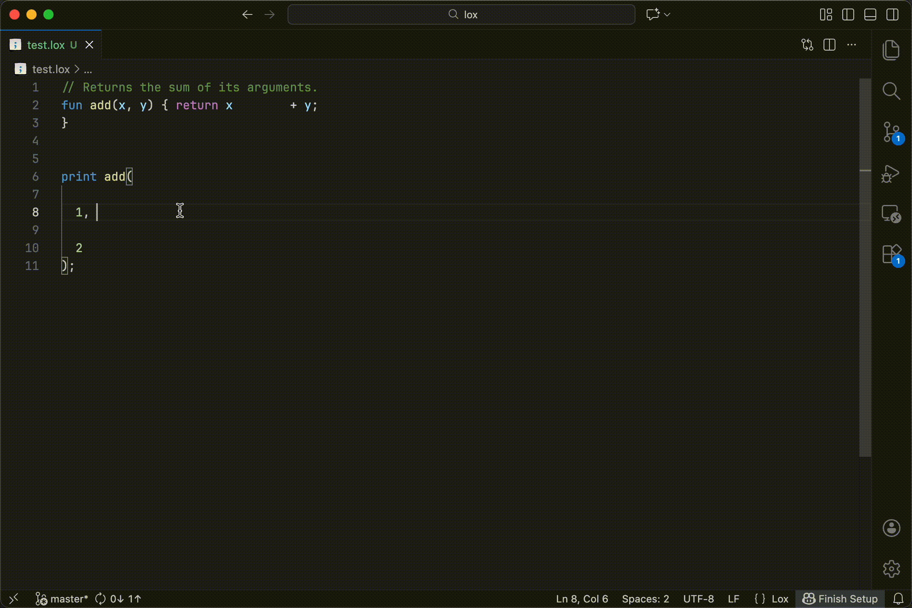

# Lox for Visual Studio Code

[The VS Code Lox extension](https://marketplace.visualstudio.com/items?itemName=marcuscaisey.lox)
provides rich language support for the Lox programming language as defined by the [Crafting
Interpreters book](https://craftinginterpreters.com).

## Features

- Syntax highlighting
- [Go to definition](#go-to-definition)
- [Go to references](#go-to-references)
- [Hover information](#hover-information)
- [Outline view](#outline-view)
- [Code completion](#code-completion)
- [Diagnostics](#diagnostics)
- [Signature help](#signature-help)
- [Formatting](#formatting)
- [Renaming](#renaming)

## Requirements

- Visual Studio Code 1.74 or newer

## Quick Start

1.  Install the [VS Code Lox
    extension](https://marketplace.visualstudio.com/items?itemName=marcuscaisey.lox).

1.  Open any Lox file to automatically activate the extension.

The extension depends on `loxls` (the Lox language server) to provide language features. `loxls` is
bundled with the extension on most operating systems:

- Windows ARM
- macOS Intel
- Linux ARM64
- Windows x64
- macOS Apple Silicon
- Alpine Linux 64 bit
- Alpine Linux ARM64
- Linux ARM32
- Linux x64

To enable language features on unsupported operating systems, install `loxls` with

```sh
go install github.com/marcuscaisey/lox/loxls@latest
```

and then set `lox.loxlsPath` to its path. To disable language features, set `lox.useLanguageServer:
false`.

## Feature Demos

### Go to Definition


### Go to References



### Hover Information



### Outline View



### Code Completion


### Diagnostics


### Signature Help


### Formatting



### Renaming


## Attribution

The `.lox` file type icon and icon for this extension are taken from the favicon and header of
[*Crafting Interpreters*](https://craftinginterpreters.com/) by Bob Nystrom.
Used under the [CC BY-NC-ND 4.0 License](https://creativecommons.org/licenses/by-nc-nd/4.0/).
